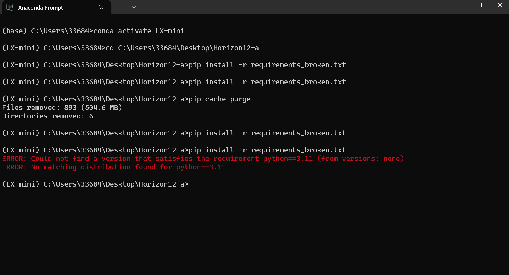

# 依赖冲突分析报告

## 环境信息
 - 操作系统：Windows 11
 - Python 版本：3.11
 - 运行环境：Conda 独立隔离环境 LX-mini
 - 硬件配置：CPU only

## 主要冲突问题分析
### 问题1：sklearn==0.0 是无效空包（包名/版本陷阱）
表现：安装直接冲突、依赖无法正常解析。
根因：sklearn==0.0 为 PyPI 占位假包，无任何实际代码与功能；机器学习合法安装包名为 scikit-learn。
类型：包名错误 + 无效版本问题。

### 问题2：torch 与 torchvision 版本完全不匹配（包间强依赖冲突）
表现：即使安装完成，代码导入报错、模型无法运行。
根因：torch==2.2.0 官方强制配套 torchvision==0.17.0，原文件写入 0.10.0，跨大版本严重不兼容。
类型：包间依赖不匹配问题。

### 问题3：numba==0.56.4 不支持 Python 3.11（Python 版本冲突）
表现：安装失败或运行时报错闪退。
根因：numba 0.56.4 最高兼容 Python 3.10，无法适配本机 Python 3.11 解释器。
类型：Python 版本与第三方库不兼容问题。

### 问题4：tensorflow==2.10.0 与 Python 3.11 不兼容
表现：依赖安装直接终止、匹配失败。
根因：TensorFlow 2.10.0 最高仅支持 Python 3.9，不兼容 3.11 高版本环境。
类型：跨版本生态不兼容问题。

## Conda 与 Pip 解析差异
1. Conda 可统一管理 Python 解释器、二进制依赖、C 扩展底层库，依赖校验严格，适合深度学习整体环境搭建。
2. Pip 仅负责纯 Python 上层依赖安装，不校验底层编译环境、Python 版本适配性。
3. 两者混用会造成底层依赖覆盖、版本错乱，极易出现安装成功但运行崩溃的隐性问题。

## 安装失败现场截图

