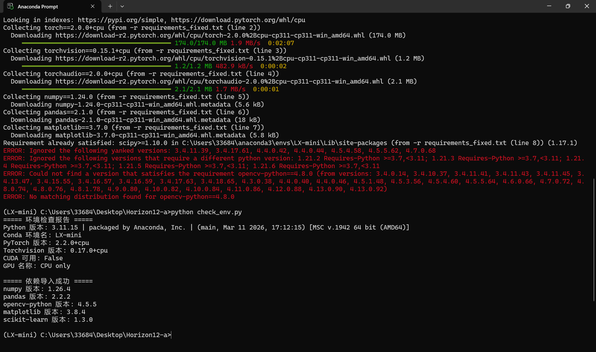

# 环境修复方案：最小修复 + 工程修复

## 基本信息
- 最小修复环境：LX-mini
- 工程修复环境：LX-project

---

## 一、最小修复（尽量少改原版）
### 修改点 + 理由
1. **sklearn==0.0 → scikit-learn==1.3.0**
- 理由：sklearn==0.0 是空包，无法使用。

2. **torchvision 0.10.0 → 0.17.0**
- 理由：与 torch 2.2.0 严格匹配。

3. **numba 0.56.4 → 0.59.1**
- 理由：支持 Python 3.11。

4. **删除 tensorflow==2.10.0**
- 理由：不支持 Python 3.11，无法修复。

5. **torch==2.2.0 → torch==2.2.0+cpu**
- 理由：指定 CPU 版本才能安装。

---

## 二、工程修复（适合 YOLO / PyTorch 训练）
### conda / pip 分工
- **conda 安装**：python、numpy、pandas、matplotlib
-- 原因：底层二进制依赖稳定，兼容性更好。

- **pip 安装**：torch、torchvision、scikit-learn、numba、opencv
-- 原因：AI 框架与第三方工具包官方更新快，版本更精准。

---

## 三、必答问题
### 1. 为什么不能用 sklearn==0.0？
sklearn==0.0 是无效空假包，无实际代码内容，安装后无法正常导入模块，直接导致环境运行崩溃。

### 2. 为什么 torch / torchvision 必须匹配？
二者接口强绑定、API 高度耦合，版本不匹配会出现导入报错、模型加载失败、训练程序中断等问题。

### 3. GPU / CPU 选择逻辑
- CPU 设备：安装 torch 时添加 `+cpu` 后缀，适配无独显环境。
- GPU 设备：通过 `nvidia-smi` 查询显卡支持的 CUDA 版本，选择对应版本，如 `+cu118`、`+cu121`。

---

## 四、避坑原则
1. 禁止使用 sklearn==0.0 等无效占位空包。
2. Torch 与 Torchvision 必须严格版本配对。
3. 安装依赖前，确认库是否兼容当前 Python 版本。
4. 底层基础科学库优先使用 conda 安装，AI 框架优先使用 pip。
5. 正式项目必须导出 yml 环境文件，保证环境可复现。

---

## 修复成功环境校验截图

